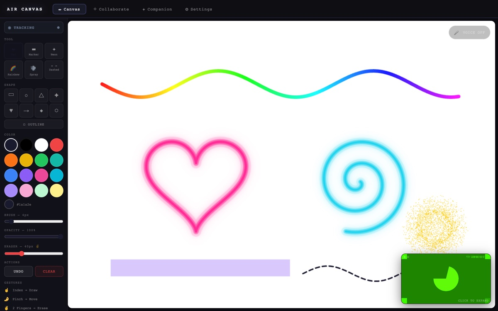
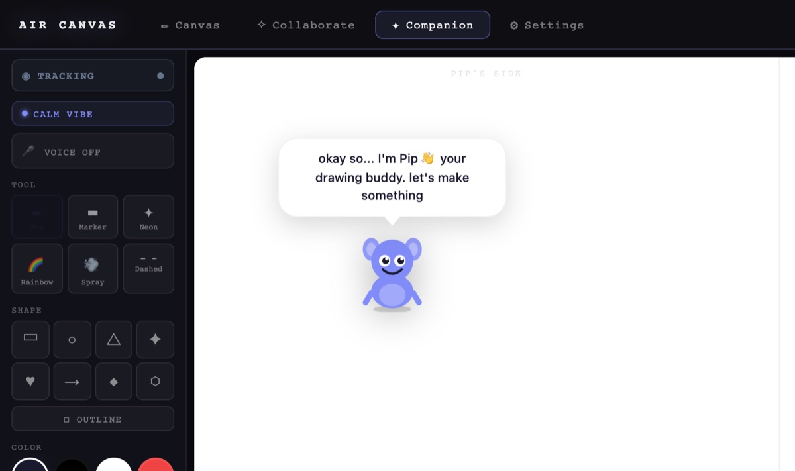
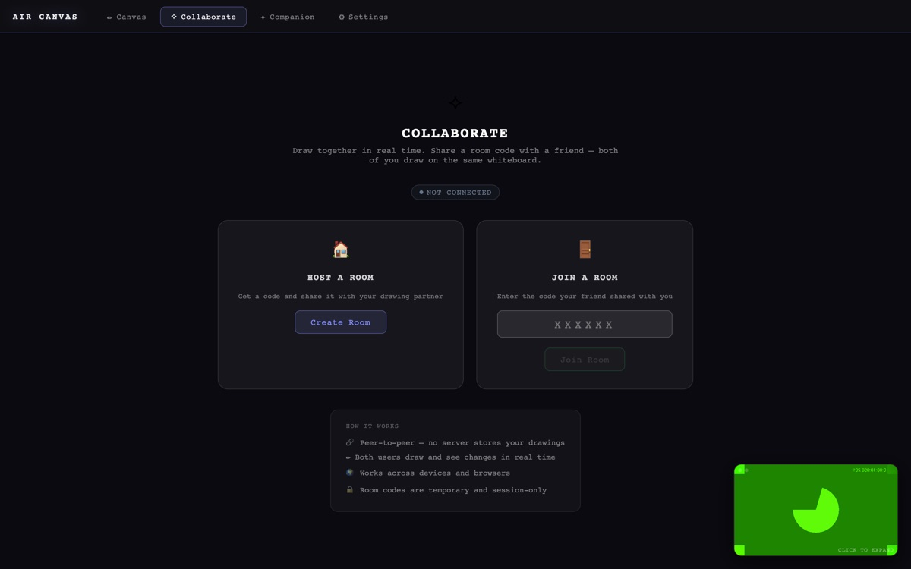

<div align="center">

# ✋ AIR CANVAS

**Draw in thin air. Your webcam tracks your hand, your index finger becomes a brush, and an AI buddy named Pip draws alongside you.**




<sub>Rainbow, neon, spray, marker and dashed brushes rendered by Air Canvas. The camera tile in the corner shows Chrome's test feed.</sub>

</div>

---

## The idea

No stylus and no touchscreen. Just raise your hand. Air Canvas turns any laptop webcam into a gesture-controlled whiteboard that tracks your hand in real time in the browser, so you can sketch, move, resize and erase with nothing but your fingers.

## Gestures

| Gesture | Action |
|---|---|
| ☝️ **Index finger** | Draw |
| 🤏 **Pinch** | Grab and move a stroke |
| 🤏🤏 **Pinch with both hands** | Resize |
| ✌️ **Two fingers / open palm** | Erase |

Prefer to talk? **Voice commands** handle the rest: *"bigger"*, *"thinner"*, *"undo"*, *"clear"*, *"start over"*.

## Features

- 🎨 **Six brushes:** pen, marker, neon glow, rainbow, spray and dashed, with any colour, size and opacity.
- 🔷 **Smart shapes:** rectangles, circles, triangles, stars, hearts, arrows and more, filled or outlined.
- 🧸 **Pip, your AI drawing buddy:** Pip lives on its own half of the canvas, wanders around, reacts to your art, recognises the shapes you draw, and can **AI Draw** a sketch from a text prompt (powered by Claude). Pick Pip's style: Normal, Calligraphy, Funny, Sketch, Glow or Rainbow.
- ✏️ **Portrait mode:** snaps a webcam frame and turns it into a pencil sketch.
- 🤝 **Collaborate in real time:** host or join a room with a 6-character code and draw on the same board peer-to-peer. No server stores your drawings.

<p align="center">
  
  
</p>

## How it's built

```
src/
├── hooks/        useHandTracking (MediaPipe Hands + TF.js), useGestureState,
│                 useDrawingState, useCollaboration (PeerJS), useVoiceCommands (Web Speech)
├── components/   CanvasOverlay, HandLandmarksOverlay, ControlsPanel, tabs/ (Canvas · Collaborate · Companion · Settings)
├── lib/          strokeUtils, shapeUtils, gestureUtils, companion (Pip), portrait (sketch filter)
api/draw.ts       serverless endpoint: prompt → Claude → drawing instructions for Pip
```

## Run it

```sh
npm install
npm run dev               # → http://localhost:5173 (allow camera access)
```

For **AI Draw**, deploy `api/draw.ts` (e.g. on Vercel) with `ANTHROPIC_API_KEY` set.

## About

Built by **Roszhan Raj**.
